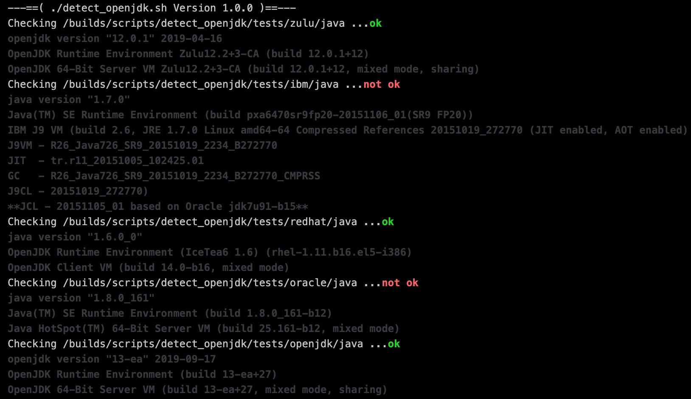

# detect_openjdk

This scrips searches for any executable named java on the filesystem and runs it with -version parameter the output is validated if it's matching the substring of "OpenJDK".

This can be used to run in the CI pipeline to check if OpenJDK is used in a Docker image.

# Return codes

* 1 - at least one executable found that is named "java" and has no "OpenJDK" in it's output when run with argument "-version"
* 0 - otherwise

# Examples

## Only OpenJDK java found (exit code 0)

## Non-OpenJDK java found (exit code >= 1)

